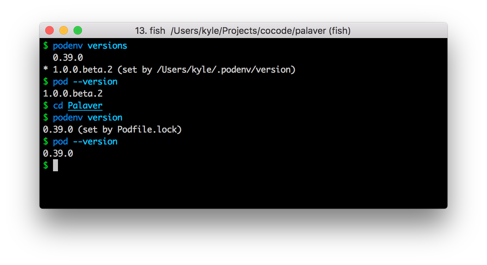

# Pod Version Manager

podenv allows you to easily install, and switch between multiple versions of
CocoaPods, without managing Ruby.



podenv allows you to:

- Change the **global CocoaPods version**, per user.
- Set a **per-project CocoaPods version**.
- Allows you to **override the CocoaPods version** with an environmental variable.

## Installation

### Via Homebrew

You can install podenv using the [Homebrew](http://brew.sh/) package manager.

```shell
$ brew install kylef/formulae/podenv
```

### Via a Git clone

1. Check out podenv, we recommend `~/.podenv` (but it can be installed elsewhere as long as you set `PODENV_ROOT`).

    ```shell
    $ git clone https://github.com/kylef/podenv.git ~/.podenv
    ```

2. Configure environment.

    For Bash:

    ```shell
    $ echo 'export PATH="$HOME/.podenv/bin:$PATH"' >> ~/.bash_profile
    ```

    For ZSH:

    ```shell
    $ echo 'export PATH="$HOME/.podenv/bin:$PATH"' >> ~/.zshenv
    ```

    For Fish:

    ```shell
    $ echo 'setenv PATH "$HOME/.podenv/bin" $PATH' >> ~/.config/fish/config.fish
    ```

3. Restart your shell so the changes take effect.

## Usage

### Getting Started

Once you've installed podenv, you can install a specific version of CocoaPods using the install command:

```shell
$ podenv install 1.0.0.beta.2
```

Alternatively, you can install the version specified in the local `Podfile.lock` file using the following:

```shell
$ podenv install
```

Then you can continue to use CocoaPods as you normally would, podenv which automatically switch to the correct version locked from your `Podfile.lock` when you run it.

```shell
$ pod --version
1.0.0.beta.2
```

### Commands

##### `version`

Displays the current active CocoaPods version and why it was chosen.

```shell
$ podenv version
0.39.0 (set by Podfile.lock)
```

##### `versions`

Lists all installed CocoaPods versions, showing an asterisk next to the currently
active version.

```shell
$ podenv versions
* 0.39.0 (set by Podfile.lock)
  1.0.0.beta.2
```

##### `global`

Sets the global version of CocoaPods to be used by writing to the
`~/.podenv/version` file. This version can be overridden by
application-specific Podfilefile, or by setting the `COCOAPODS_VERSION`
environment variable.

```shell
$ podenv global 1.0.0.beta.2
$ podenv global
1.0.0.beta.2
```

##### `install`

Installs a version of CocoaPods.

```shell
$ podenv install 1.0.0.beta.2
```

###### Listing all available versions

```shell
$ podenv install --list
1.0.0.beta.2
1.0.0.beta.1
0.39.0
0.39.0.rc.1
...
```

###### Installing Unreleased Versions

It's also possible to install directly from a branch found on the CocoaPods
repository:

```shell
$ podenv install --branch 0.39-stable
```

The version inside podenv will be the branch name, for example `0.39-stable`.

You can explicitly use this version via the environ variable, for example:

```shell
$ env COCOAPODSPOD_VERSION=0.39-stable pod
```

**NOTE**: *You may also use `--repo` to install from a different GitHub
remote.*

##### `uninstall`

Uninstalls a specific CocoaPods version.

```shell
$ podenv uninstall 1.0.0.beta.2
```

##### `exec`

Runs an executable with the selected CocoaPods version. For example, this
can be used to install CocoaPods plugins.

```shell
$ podenv exec gem install cocoapods-bugsnag
```
